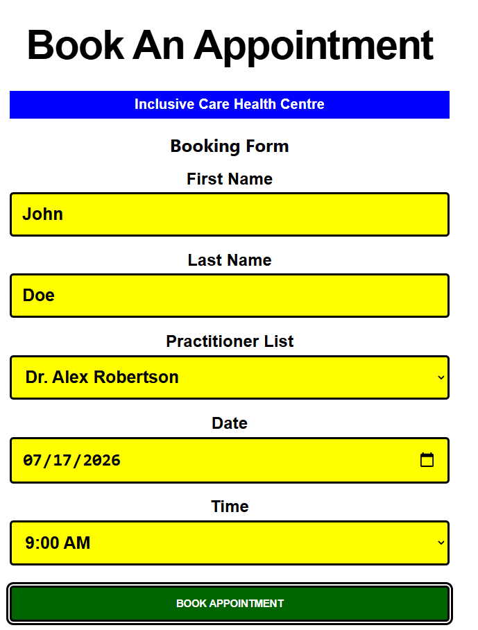
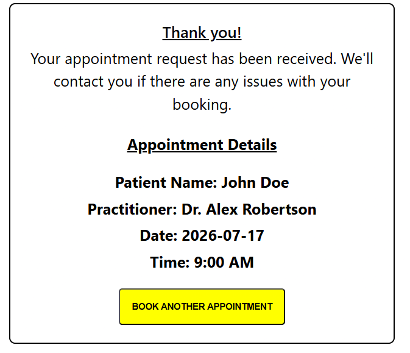
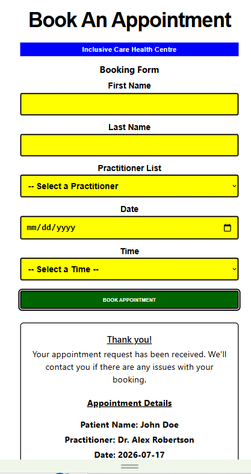

# Accessible Appointment Booking App

An accessible React application for booking medical appointments. This project demonstrates responsive design, accessible form interactions, keyboard navigation, and focus management while providing a simple appointment booking experience.

## Live Demo

View the deployed application here: https://accessible-booking-app.vercel.app/

## Features

- Responsive layout for mobile, tablet, and desktop devices
- Accessible keyboard navigation throughout the application
- High-contrast focus indicators for inputs and dropdowns
- Focus rings for buttons
- Controlled form inputs using React state
- Semantic HTML with properly associated form labels
- Automatic focus on first input field when app loads.
- Appointment confirmation summary displayed after successful submission
- Automatic focus on the confirmation summary after booking
- Automatic focus on the first input when starting a new booking
- Ability to book multiple appointments without refreshing the page
- Clear visual feedback for interactive form elements

## Accessibility Features

- Semantic HTML structure
- Properly associated form labels
- Full keyboard accessibility
- High-contrast visible focus indicators
- Logical focus management after form submission
- Responsive design for mobile, tablet, and desktop devices

## Technologies Used

- React
- Vite
- JavaScript
- HTML5
- CSS3

## Installation

- Clone the repository:

```bash
git clone <repository-url>
```

- Navigate to the project folder:

```bash
cd accessible-appointment-booking-app
```

- Install the project dependencies:

```bash
npm install
```

- Start the development server:

```bash
npm run dev
```

- Open the local URL displayed in the terminal (typically `http://localhost:5173`).

## Deployment

This project is deployed using **Vercel**.

To deploy your own version:

- Push the project to GitHub.
- Sign in to Vercel.
- Select **Add New → Project**.
- Import your GitHub repository.
- Confirm the build settings:
  - **Framework Preset:** Vite
  - **Build Command:** `npm run build`
  - **Output Directory:** `dist`

- Click **Deploy**.

Future pushes to your main branch will automatically trigger new deployments.

## Future Improvements

- Add appointment editing and cancellation functionality.
- Implement client-side form validation with accessible error messages.
- Store practitioner and time data in a separate file.
- Store appointment data using a backend API or database.
- Add user authentication for managing appointments.
- Send appointment reminders or email confirmations.
- Display booking confirmation on a separate page
- Add appointment reminders or email confirmations.

## Screenshots

### Booking Form



### Confirmation Summary



### Mobile View


